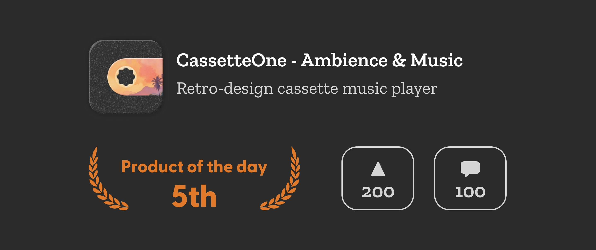

Not long ago, I saw someone on YouTube sharing their collection of cassette players from decades ago, which brought me back to my elementary school days. Although my family was poor and couldn't afford a cassette player, I had seen them at my classmates' homes and even found cassettes on the roadside, which I used as stress-relief toys by turning them with a pencil, having a lot of fun.

At that moment, an idea suddenly popped into my head: why not create a cassette player on a mobile phone? So, I immediately searched the App Store and found many well-made apps that mimic the effect of a cassette player. However, each one seemed to lack something, so I decided to make one myself. After about two weeks, referencing many excellent app designs, I finally launched [CassetteOne](https://weel.one/cassette-ios) on the [App Store](https://weel.one/cassette-ios). CassetteOne comes with some white noise and can connect to Apple Music to play your own playlists, with different interface themes to choose from.

Since I was short on money, I set CassetteOne as a paid app, thinking it would be a good opportunity to hone my marketing skills. Initially, I posted a tweet, like most marketing tweets, setting a limited-time discount price and offering some free redemption codes for a giveaway. The tweet eventually got around 50,000 impressions, nearly 200 likes, and about 50 retweets. The data didn't look too bad, with nearly 10 purchases. However, two days later, with no further promotion, sales remained at zero. Perhaps posting a tweet with each update could bring some traffic, but there's still a long way to go for users to promote it spontaneously.

I had known for a long time that Product Hunt is a great platform for cold-starting products, but I always had some misconceptions about it, thinking that I had to perfect the product before launching it on Product Hunt to achieve good results. This perfectionist trap held me back. This time, I decided not to worry about perfection and just launch a usable version first.

## Launching on Product Hunt

Although there have been many controversies about Product Hunt recently, with many AI-generated comments from account farmers and people offering paid voting services to gain more votes and increase account weight, it is still the best platform for cold-starting products.

To conclude, the launch on Product Hunt went quite well, achieving fifth place of the day with over 200 votes and nearly 50 comments. The data looks similar to the previous tweet, but the actual effect feels better (although sales data is not yet available at the time of writing).

Product Hunt's list updates daily at 0:01 AM Eastern Time, and during the first four hours after the update, the homepage does not display the number of votes for products, and the ranking is random. This prevents products that rank high initially from gaining more exposure and votes, making it difficult for lower-ranked products to catch up. This is a great opportunity for independent developers who can't get a lot of votes right away.

My CassetteOne was ranked first when the ranking was not yet fixed, and someone even posted a tweet recording this moment. However, shortly after the ranking was announced, it dropped to fifth place. When I investigated the reason, I found that a product can be launched multiple times as long as there are significant updates. For example, many products launch separately when adding AI features. When voting for a product, users automatically follow it, and they will receive notifications when the product releases new content. This means that the next launch will come with some built-in exposure. This was a misconception I had about Product Hunt, thinking that I could only launch once, so I waited until the product was perfect before daring to launch. In fact, you can launch at different stages of the product, leaving an impression on the market early and gradually accumulating attention.

Although the final sales result was not as good as the previous tweet, bringing in only about 8 paying users, it's important to note that I have 4,000 followers on Twitter, plus a bunch of familiar friends in my circle. This result can't be compared to Product Hunt, where no one knows me. On Product Hunt, the users are completely strangers, and I can see in the backend that the buyers come from all over the world, including the US, India, Germany, Australia, the Netherlands, Ireland, and Brazil, with each purchase coming from a different country.

## After This

Meanwhile, as mentioned earlier, there was a tweet recording CassetteOne's first-place moment, which was not posted by me but by an automated bot. This is another benefit of launching on Product Hunt, as many product managers and bots monitor the leaderboard. If you achieve a high ranking, you can gain considerable traffic, and some people will help promote it. For example, if you search for CassetteOne on Google now, besides my own website, the Product Hunt page, and the Reddit promotion post I made, there are also some scattered websites that have included this product. Although most are content farm-type meaningless sites, it's still better than nothing.

CassetteOne didn't spread much because it didn't rank very high, and not many people noticed the fifth place. But if the ranking were better, like making it to the top three, it would likely spread further. For example, I once wrote a [Twitter bot](https://x.com/ph_summary) to translate and summarize the top three entries on Product Hunt daily into Chinese, so even my own bot didn't capture CassetteOne.

Additionally, you can put Product Hunt ranking information on your product's website to increase user trust. It can also attract users to vote on Product Hunt, bringing more attention when you release new features in the future. I have also placed related icons on [CassetteOne's website](https://cassette.one).

## Prepare Early

Product Hunt determines account weight based on the number of votes received, registration time, and other information. Accounts with higher weight have a greater impact on the ranking, so sometimes products with fewer votes may rank higher than those with more votes. Also, if your account is linked to Twitter, your Twitter followers will automatically follow your Product Hunt account, and they will receive email notifications when you launch a product.

Therefore, it's best to register your account early, actively participate in the community, vote, and comment more. This way, when you launch your product, more people will notice it.
