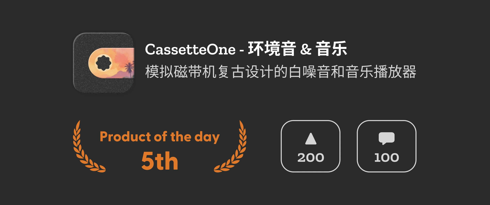

前不久在 YouTube 上看到一个人分享他自己收藏了几十年的磁带机，仿佛又把我拉回了我还在上小学的那个年代。虽然我家穷，没有磁带机这种东西，但在同学家里还是见过的，也在路边捡到过磁带，并当作解压玩具用铅笔转着玩，玩得不亦乐乎。

这时我脑子里突然冒出一个想法，何不在手机上实现一个磁带播放机呢。于是马上跑到 App Store 里搜索了一通，发现已经有很多做得不错的 app，都是在模仿磁带的效果。但每一个都觉得差了点啥，于是决定还是自己做一个。花了两周左右的时间，参考了许多优秀 app 的设计，最终上架了 [CassetteOne](https://weel.one/cassette-ios) 到 [App Store](https://weel.one/cassette-ios)。CassetteOne 内置了一些白噪音，也可以连接 Apple Music 播放自己的歌单，还实现了不同的界面主题可供选择。

由于现在手里有点缺钱，于是将 CassetteOne 设置为了付费应用，与此同时想着正好可以锻炼锻炼自己的营销能力。一开始我在 Twitter 里发布了一条贴文，像大多数营销贴文一样，设置一个限时优惠价格，提供一些免费的兑换码来抽奖。最终这条推文曝光量有 5 万左右，点赞数接近 200 ，有接近 50 人转发。其实数据看起来也不是太糟糕，最终购买的也有接近 10 人。但两天过后，在完全没有了宣传时，销量就始终保持在 0 。也许后面每次更新时再发布一条推文，也能获得一些流量，但这离用户自发地宣传还有很长的路要走。

很久之前我就知道 Product Hunt 是一个很不错的冷启动平台，但一直以来对它都有一些误解，以至于产生了必须先把产品做到尽善尽美，然后再去 Product Hunt 上发布，才能获得比较好的效果，这种有点陷入完美主义陷阱的想法。但是这次我决定，不要那么在意完美，先做一个能用的版本，发上去再说。

## 发布到 Product Hunt

虽然最近关于 Product Hunt 的争议挺多的，而且里面充斥许多养号用户的 AI 评论，为了获得更多的投票，提高账号的权重，也有人在做收费拉投票的生意。但目前它仍然是产品冷启动的最佳平台。

先说结论，这次在 Product Hunt 上发布的效果还不错，最终获得了当日第五名，一共 200 多个投票、接近 50 个评论。这个数据咋看起来和之前的推文差不多，但实际效果从感觉上来说是要好一些的（虽然截止本文发布时还看不到销售量）。

Product Hunt 的列表是按天更新的，每天美东时间的凌晨 0:01 会更新当天的列表，而在列表更新的前四个小时里，在主页不会展示产品的投票数，排名也是随机的。这样有一个好处，就是可以避免一开始排名高的产品就会获得更多得曝光量，而获得更多的投票，使得排名靠后的产品没法追赶。这样对于没有能力在一开始就就获得大量投票的独立开发者来说，是一个很好的机会。

我的 CassetteOne 在一开始排名还没有固定时，投票数一直在第一，还有其他人发的一条无人问津的推文记录了这个时刻。但是当排名公布后不久，一路直跌到了第五。当我在查找原因时，才发现原来一个产品是可以发布多次的，只要有重大更新就可以单独发布，比如很多产品在添加了 AI 功能后，都会单独发布这个功能。并且在给产品投票时，会自动 follow 这个产品，当这个产品以后发布新内容时，都会收到通知。这样就意味着在下一次发布时，就会自带一部分曝光。这也是我对 Product Hunt 有误解的地方，之前以为只能发布一次，所以一直在等产品做到尽善尽美，才敢发布。其实完全可以在产品的不同阶段都发布一次，这样可以在一开始就给市场留下一点印象，并且可以逐步地累积关注度。

虽然最后看销售量，结果并没有之前发推特带来的效果好，只带来了 8 个左右的付费用户。但是要知道，我的推特有四千粉丝，再加上朋友圈里一众熟悉的朋友，这个结果肯定是不能和在完全没有人认识的 Product Hunt 上对比的。在 Product Hunt 上，带来的完全是陌生的用户，在后台能看到购买的用户都是来自世界各地的，有美国、印度、德国、澳大利亚、荷兰、爱尔兰和巴西，基本上每个购买都来自不同的国家。

## 在这之后

与此同时，前面也说到有一条无人问津的推文记录了 CassetteOne 投票数保持在第一的时刻，这条推文并不是我发的，而是其他自动记录的机器人发的。这也是在 Product Hunt 上发布的好处之一，因为有许多的产品经理和机器人都在盯着这个排行榜，如果取得了较高的名次，就会有人获得可观的流量，也有人主动帮忙发帖宣传。就像现在如果在 Google 上搜索 CassetteOne，除了我自己架设的官网、Product Hunt 的页面、Reddit 上我发的推广贴外，还零星有一些网站收录了这个产品。虽说大多是内容农场类无意义的网站，但也比完全没有要好一些。

CassetteOne 因为排名不是很出众，能关注到第五名的人不是很多，所以并没有怎么传播。但如果成绩在好一点，比如进到前三的话，相信会传播得更远。像是我自己就曾写过一个 [Twitter 的机器人](https://x.com/ph_summary)，用来将每天 Product Hunt 排名前三的条目翻译为中文并总结起来，所以我自己写的机器人都没能搜录 CassetteOne。

此外，你还能将 Product Hunt 的排名信息放到产品的官网上，用来增加用户的信任感。同时也可以吸引用户到 Product Hunt 投票，为以后再次发布新功能时带来更多关注度。我也在 [CassetteOne 的官网](https://cassette.one) 上放上了相关的图示。

## 准备要趁早

因为 Product Hun 会根据获得投票数、注册时间等信息来决定账号的权重，权重越高的账号投票排名的比重也会更高，所以有时会出现投票数少的产品排在投票数较多的产品前面的情况。而且如果账号和 Twitter 绑定后，Twitter 的粉丝会自动同时关注你的 Product Hunt 账号，在发布产品时，已关注你的用户将会收到邮件通知。

所以最好尽早注册好账号，并积极参与社区，多投票、多评论，这样在发布产品时，会有更多的人关注到你的产品。
