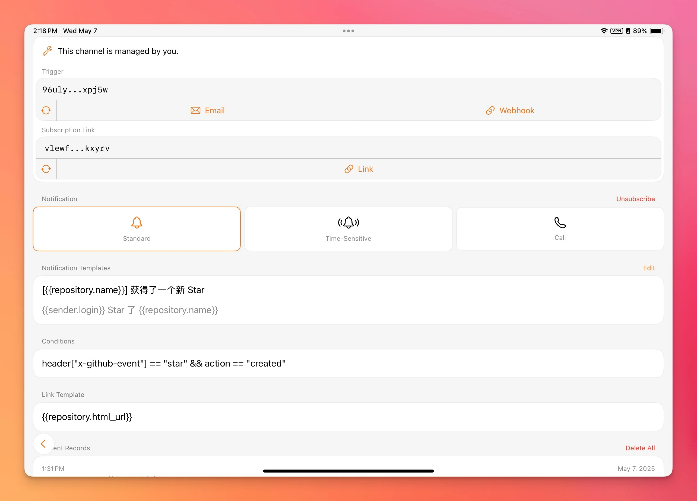

As a relatively unknown developer, every time I release a small tool on GitHub, I find myself constantly refreshing the page to see if anyone has starred it. This not only affects my work efficiency but also creates an additional mental burden. It would be much better to be actively notified when a new star is received, or when any other event occurs in the repository.

Today, I'll introduce how to use my latest product, Echobell, to get notified when your GitHub repository receives a new star. Before we begin, you'll need to download and install Echobell from the [App Store](https://apps.apple.com/app/apple-store/id6743597198?pt=126931111&ct=Nooc&mt=8) to receive notifications. If you've already installed it, please make sure it's updated to the latest version, as the channel conditions feature we'll be using was recently added.

## Create an Echobell Channel

First, create a channel in Echobell to receive notifications. You can use the following example information when creating the channel:

- Channel Name: `GitHub star`
- Notification Template - Title: `[{{repository.name}}] received a new Star`
- Notification Template - Body: `{{sender.login}} starred {{repository.name}}`
- Condition: `header["x-github-event"] == "star" && action == "created"`
- Link Template: `{{repository.html_url}}`

The condition `header["x-github-event"] == "star" && action == "created"` ensures that a notification is triggered only when someone stars the repository, and no action is taken when a star is removed. The link template `{{repository.html_url}}` will provide a link to the repository in the notification record, allowing you to quickly navigate to the corresponding repository by clicking it. The `{{name}}` format refers to information provided by GitHub Webhooks; for more available data, you can refer to GitHub's [official documentation](https://docs.github.com/en/webhooks). You can also combine conditions and templates according to your own needs. For Echobell's template usage, please refer to [this document](https://echobell.one/en/docs/template).

The created channel details are shown in the image above. At this point, the operations on the Echobell side are complete. Click the `Webhook` button on the channel details screen and copy the link for later use. Now, you need to add a Webhook on GitHub, and then you can receive notifications in Echobell.

## Add a Webhook to GitHub

GitHub Webhooks are divided into repository Webhooks and organization Webhooks. If you only want to receive notifications when a specific repository gets a new star, you need to add a Webhook in that repository's settings. If you want to receive notifications when any repository under an organization gets a new star, you need to add a Webhook in that organization's settings. The adding method and settings are identical; only the entry point and invocation timing differ. Here, we'll use a repository Webhook as an example:

1. Go to the repository for which you want to receive notifications and click the `Settings` tab (for organization Webhooks, it's the organization's `Settings`).
2. Click `Webhooks` in the sidebar to enter the Webhook management interface.
3. Click the `Add Webhook` button to add a Webhook.
4. On the Add Webhook page, fill in the following information:
5. - Payload URL: Paste the Echobell Webhook link you copied earlier.
6. - Content type: Select `application/json`.
7. - Select `Let me select individual events.`, uncheck the default `Pushes`, and then check the `Stars` event.
8. - Click the `Add Webhook` button to complete the setup.

All settings are now complete. You can test it by starring the repository yourself to see if you receive a notification in Echobell, and then unstarring it to test if removing a star triggers a notification (according to our previous settings, removing a star should not trigger a notification).

You can also add this channel's Webhook to other repositories for which you want to receive notifications, or directly to an entire organization. Our message template is already configured to display the repository name, so you can distinguish stars from different repositories.

## More

This was just an example using stars. You can also add notifications for any other events according to your needs, such as receiving a new PR, someone creating a new issue, etc. Simply select the corresponding event type when adding the Webhook and configure the corresponding notification template and conditions in Echobell. There are many more possibilities for you to discover.
