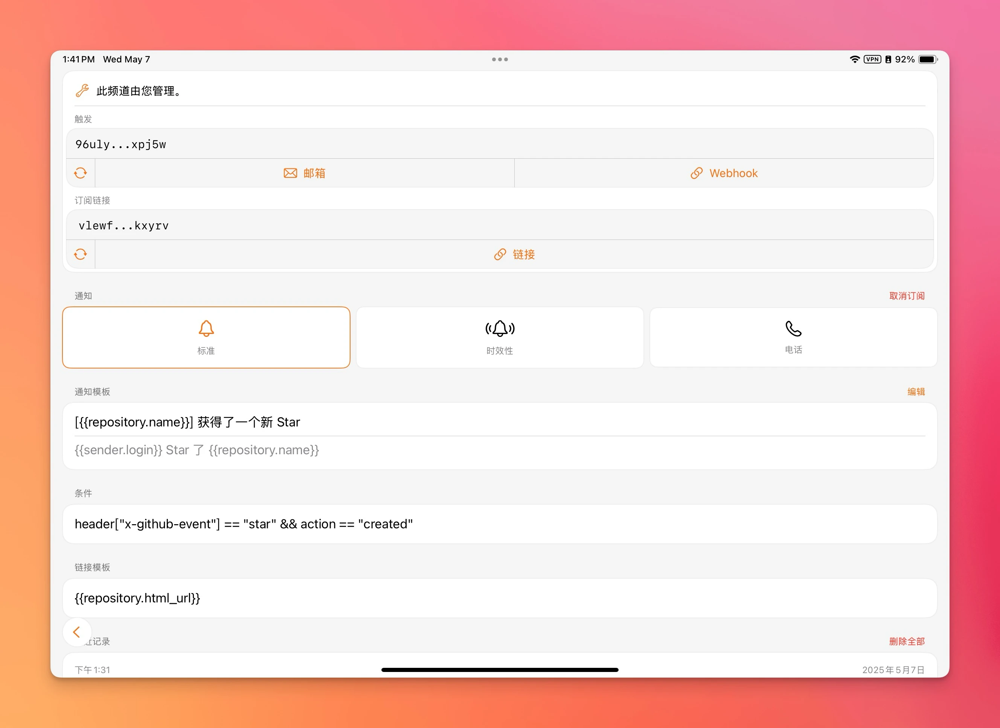
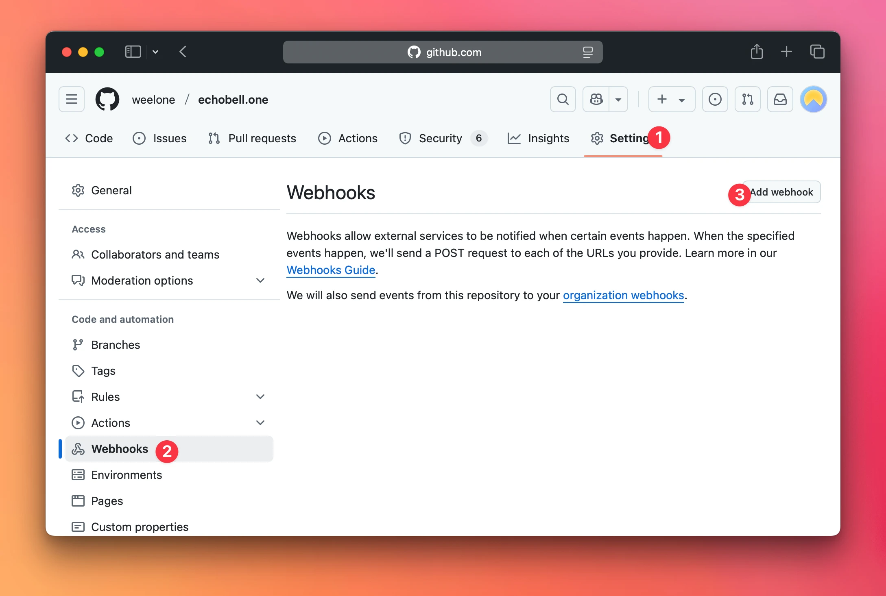
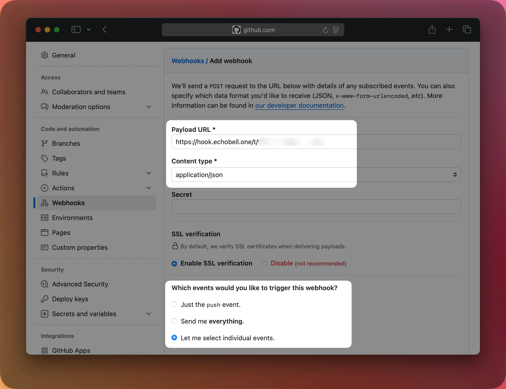

作为一个没什么影响力的小透明，每次在 GitHub 上发布一个小玩具后，都会时不时地去刷新一下，看看有没有小伙伴点了 Star 。但这样不仅会影响我的工作效率，还造成了额外的心智负担，索性不如当有新 Star 时，主动地通知我。或者是在仓库发生了其他任何事件时，收到该事件的通知。

今天就给大家介绍一下，如何使用我最新的产品 Echobell ，来实现当 GitHub 的仓库有新 Star 时获得通知。在这之前，你需要先在 [App Store](https://apps.apple.com/app/apple-store/id6743597198?pt=126931111&ct=Nooc&mt=8) 下载安装 Echobell 来收取通知。如果你之前就已经安装了，请确保已经更新到最新版本，因为我们要用到的频道条件功能是最新版才添加的。

## 创建 Echobell 频道

首先，在 Echobell 中创建一个频道用于接收通知，创建频道时的信息可以参照如下示例：

- 频道名称: `GitHub star`
- 通知模板 - 标题: `[{{repository.name}}] 获得了一个新 Star`
- 通知模板 - 正文: `{{sender.login}} Star 了 {{repository.name}}`
- 条件: `header["x-github-event"] == "star" && action == "created"`
- 链接模板: `{{repository.html_url}}`

其中的条件 `header["x-github-event"] == "star" && action == "created"`, 是确保当有其他小伙伴 Star 时才触发通知，取消 Star 时不进行任何操作。链接模板 `{{repository.html_url}}` 将会在通知记录中提供一仓库的链接，点击即可快速导航到对应的仓库。 `{{name}}` 的格式均为 GitHub 的 Webhook 提供的信息，更多可用的数据可以参考 GitHub 的[官方文档](https://docs.github.com/en/webhooks)。你也可以按自己的需求来组合条件和模板，Echobell 的模板用法参见[这篇文档](https://echobell.one/zh/docs/template)。

最后创建的频道详情如上图所示。至此 Echobell 这边的操作就已完成，点击频道详情界面的 `Webhook` 按钮复制链接备用。现在需要到 GitHub 添加 Webhook，然后就可以在 Echobell 里收到通知了。

## 为 GitHub 添加 Webhook

GitHub 的 Webhook 分为仓库及 Webhook 和组织及 Webhook 。如果你只想在某个仓库有新 Star 时收到通知，你需要在该仓库的设置中添加 Webhook；如果你想在某个组织下的所有仓库有新 Star 时都收到通知，你需要在该组织的设置中添加 Webhook。他们的添加方式和设置是完全相同的，只是入口和调用时机不同。这里以仓库 Webhook 为例：

1. 进到你想要收到通知的仓库，点击 Tab 栏里的 `Settings`（组织 Webhook 则为组织的 `Settings`）
2. 点击侧边栏的 `Webhooks` 进入 Webhook 管理界面
3. 点击 `Add Webhook` 按钮添加 Webhook
4. 在添加 Webhook 的页面中，填写以下信息：
5. - Payload URL: 粘贴之前复制的 Echobell Webhook 链接
6. - Content type: 选择 `application/json`
7. - 选择 `Let me select individual events.`，取消勾选默认的 `Pushes` 然后勾选 `Stars` 事件
8. - 点击 `Add Webhook` 按钮完成设置

现在所有设置均已完成，你可以自己点击该仓库的 Star ，测试能否在 Echobell 收到通知，然后再取消 Star，测试取消 Star 时是否会触发通知（按照我们前面的设置，取消 Star 是不会收到通知的）。

同时你还可以将该频道的 Webhook 添加到其他你想要收到通知的仓库，或者是直接添加到整个仓库。在我们的消息模板中已经配置好仓库名的显示，可以区分来自不同仓库的 Star 。

## 更多

这里只是以 Star 为例，你还可以根据自己的需求，添加任何其他事件的通知，像是收到新的 PR、有人创建了新的 Issue 等。只需要在添加 Webhook 时，选择相应的事件类型，然后在 Echobell 中配置相应的通知模板和条件即可，更多玩法等你来发现。
